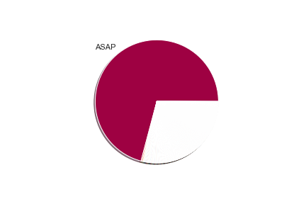

# Data Wrangling

### Introduction
This repo is a part of Data Wrangling course in [udacity](https://udacity.com) Data Analysis Professional Nanodegree

### Dataset
The dataset we used here is [Armenian Online Job Postings](https://www.kaggle.com/udacity/armenian-online-job-postings) from [kaggle](https://www.kaggle.com)
19,000 online job postings from 2004 to 2015 from Armenia's CareerCenter.

### Lesson one (Introduction to data wrangling)
1- Gathering Data
* downloading a file from the internet, which in this case was a zip file from Kaggle,
* opening a Jupyter Notebook,
* unzipping the zip file using Python,
* then importing the extracted CSV file into a pandas DataFrame in the Jupyter Notebook.

2- Assessing Data 
So far we identified the following issues in the data:
* Nondescriptive column headers
* Missing values (i.e. NaNs)
* Inconsistent representations of values, specifically "As soon as possible" and other similar values to "ASAP" in the StartDate column for this dataset
* A messy (i.e. untidy) dataset

3- Cleaning Data
* Define
  * Select all nondescriptive and misspelled column headers (ApplicationP, AboutC, RequiredQual, JobRequirment) and replace them with full words (ApplicationProcedure, AboutCompany, RequiredQualifications, JobRequirement)
  * Select all records in the StartDate column that have "As soon as possible", "Immediately", etc. and replace the text in those cells with "ASAP"
  
* Code

* Test

4- Storing Data (Optional)
* After reassessing your data and revisiting any steps of the data wrangling process deemed necessary, storing your cleaned data can be the next logical step. Storing data is important if you need to use your cleaned data in the future.

5- Analysis and Visualizations
* Created a pie chart for ASAP Start Dates before and after cleaning the data

before

after

## Data Wrangling Summary

### Gather
* Depending on the source of your data, and what format it's in, the steps in gathering data vary.
* High-level gathering process: obtaining data (downloading a file from the internet, scraping a web page, querying an API, etc.) and importing that data into your programming environment (e.g., Jupyter Notebook).

### Assess
* Assess data for:
 * Quality: issues with content. Low quality data is also known as dirty data.
 * Tidiness: issues with structure that prevent easy analysis. Untidy data is also known as messy data. Tidy data requirements:
   * Each variable forms a column.
   * Each observation forms a row.
   * Each type of observational unit forms a table.
* Types of assessment:
  * Visual assessment: scrolling through the data in your preferred software application (Google Sheets, Excel, a text editor, etc.).
  * Programmatic assessment: using code to view specific portions and summaries of the data (pandas' head, tail, and info methods, for example).

### Clean
* Types of cleaning:
  * Manual (not recommended unless the issues are single occurrences)
  * Programmatic
* The programmatic data cleaning process:
  * Define: convert our assessments into defined cleaning tasks. These definitions also serve as an instruction list so others (or yourself in the future) can look at your work and reproduce it.
  * Code: convert those definitions to code and run that code.
  * Test: test your dataset, visually or with code, to make sure your cleaning operations worked.
* Always make copies of the original pieces of data before cleaning!
### Reassess and Iterate
* After cleaning, always reassess and iterate on any of the data wrangling steps if necessary.
### Store (Optional)
* Store data, in a file or database for example, if you need to use it in the future.

